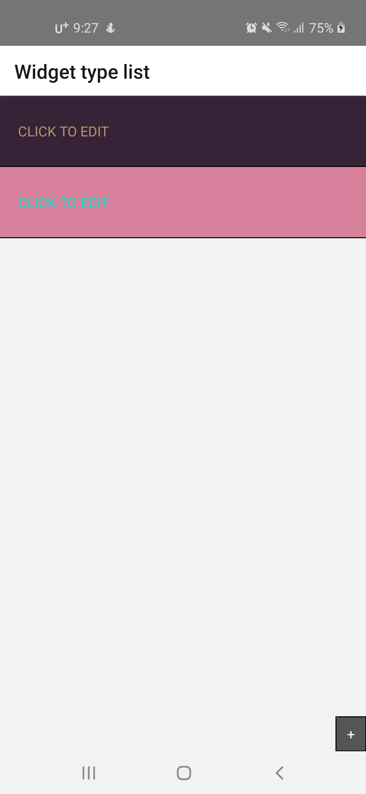
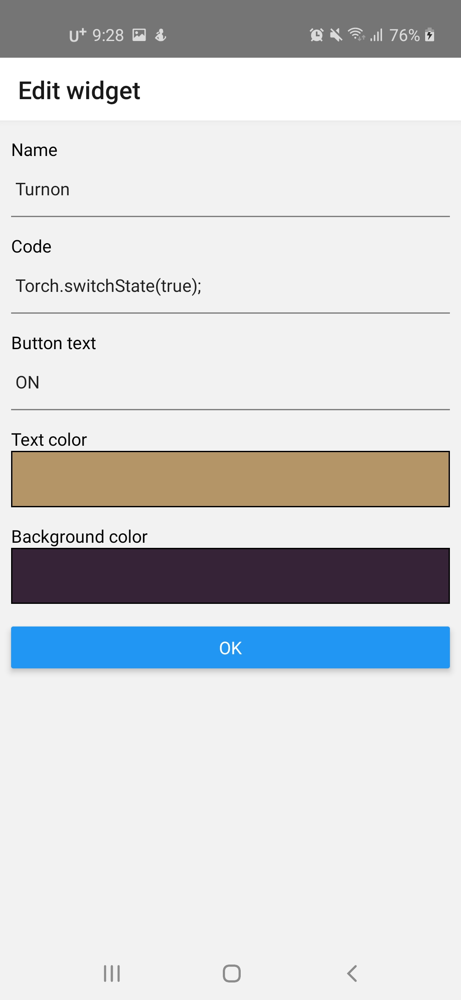
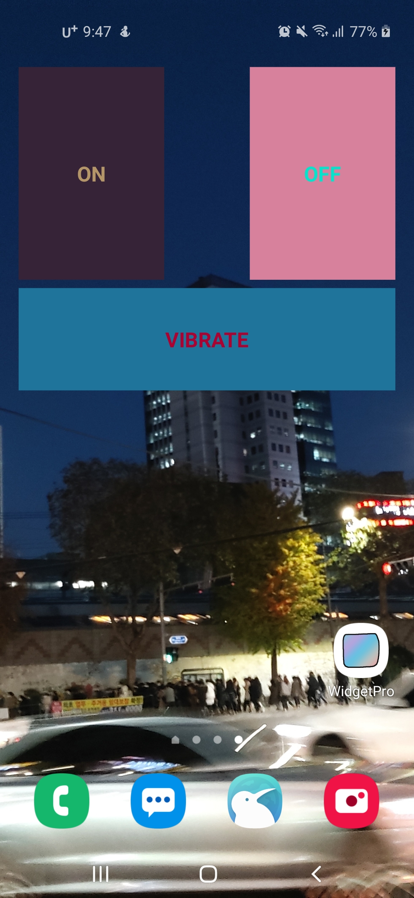

# Widget pro
안드로이드용 프로그래밍 가능한 위젯!
JS를 이용해 위젯이 할 행동을 정할 수 있습니다.

현재는 React Native 기능 fetch, Vibration, AndroidToast, Torch를 지원합니다.

## Screenshots




## Usage
### fetch
웹 fetch와 동일합니다.
[MDN Fetch](https://developer.mozilla.org/docs/Web/API/Fetch_API)
### Vibration
React Native Vibration입니다.
```js
// Vibration
Vibration.vibrate(1000);

// Cancle
Vibration.cancle();
```
### AndroidToast
React Native AndroidToast입니다.
```js
AndroidToast.show("SHORT", AndroidToast.SHORT);
AndroidToast.show("LONG", AndroidToast.LONG);
```
### Torch
[react-native-torch](https://github.com/ludo/react-native-torch)의 Torch입니다.
```js
// Torch on
Torch.switchValue(true);
// Torch off
Torch.switchValue(false);
```